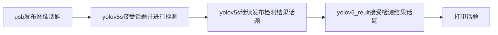

# yolov5s_trt_ros

## 项目效果：

利用TensorRT对yolov5s进行加速，并将其应用于ROS，实现交通标志、红绿灯(直接输出路灯状态)、行人和车辆等交通场景的检测。

在本人的jetson Agx xavier开发板上跑出约19ms~20ms/帧的速度，并可极好的检测目标物体，是配置自动驾驶算法的良好选择。在ROS中运行的效果如下：

<div align=center>

</div>

## 项目构成：

本项目分为两个部分：yolov5s-trt构建和添加ROS通信。

### 1.yolov5s-trt构建

1. 由于要结合ROS通信，所以我修改了原本要生成yolov5s.engine文件的`yolov5s.cpp`，所以大家在进行这一步时，可以先根据该链接：[egbertYeah/yolov5s_bdd100k_trt: yolov5s suitable for bdd100k with tensorrt inference, support image folder and video input, and mAP testing in tensorrt (github.com)](https://github.com/egbertYeah/yolov5s_bdd100k_trt)生成yolov5s.engine文件，再将yolov5s.engine放入本项目中即可。放入位置：`yolov5_trt_ros/src/yolo_detect/src/yolov5s.engine`。

   1. 在build中生成yolov5s可执行文件

   ```sh
   cd yolov5s_trt_ros/src/yolo_detect/src
   mkdir build && cd build    
   cmake ..
   make
   ```

   2. 运行`./yolov5s -s` 在build文件夹内生成yolov5s.engine文件

### 2.添加ROS通信

1. 本项目使用自定义消息类型，如下所示：

   ```sh
   string ClassName
   int32 conf
   int32 tl_x
   int32 tl_y
   int32 br_x
   int32 br_y
   ```

2. 运行如下操作

   ```sh
   #终端1
   cd yolov5s_trt_ros
   catkin_make
   roslaunch usb_cam usb_cam-test.launch  \\运行usb摄像头
   
   #终端2
   rosrun yolo_detect yolov5s        \\运行检测节点
   
   #终端3
   rostopic echo yolov5_result       \\打印话题消息
   ```

### 3.总结

本项目虽是yolov5-trt-ros在jetson agx Xavier运行成功的版本，但完全可以移植到任何设备上。其逻辑如下所示：



如果在配置过程中有任何问题，都可以留言，我会很热情的回答你们。
